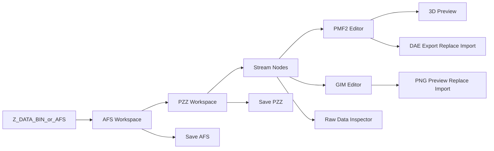

# GVG Modding Tool Design

## 已確認的基礎

- 現有 CLI 已提供核心格式能力：[rust_converter/src/main.rs](e:/research/gvg_np/rust_converter/src/main.rs) 包含 `ExtractPzz`、`ExtractStreams`、`Pmf2ToDae`、`DaeToPmf2`、`RepackPzz`、`PatchAfs`、`Pipeline` 等流程。
- PMF2 的主資料模型可復用：[rust_converter/src/pmf2.rs](e:/research/gvg_np/rust_converter/src/pmf2.rs) 已有 `Pmf2Meta`、`rebuild_pmf2`、`patch_pmf2_with_mesh_updates`、transform patch 與 bbox 重算邏輯。
- PZZ 已有完整性處理基礎：[rust_converter/src/pzz.rs](e:/research/gvg_np/rust_converter/src/pzz.rs) 已包含 `extract_pzz_streams`、`rebuild_pzz_from_original`、`compute_pzz_tail`。
- AFS 目前偏向替換既有 entry：[rust_converter/src/afs.rs](e:/research/gvg_np/rust_converter/src/afs.rs) 有 `patch_afs_entry`，但完整新增 AFS 檔案數量需要更嚴格處理主表、name table、2048 對齊與 inventory 重建。
- UI 技術參考：`egui` 適合用 `SidePanel`、`TopBottomPanel`、`CentralPanel`、`ScrollArea`、`CollapsingHeader` 建主介面；`egui_dock` 可提供可停靠 tab workspace。`ssbh_editor` 的 [E:/research/ssbh_editor/src/app.rs](E:/research/ssbh_editor/src/app.rs) 類似使用 left file list、right inspector、central 3D viewport，並透過 `egui_wgpu::Callback` 嵌入 wgpu render。

## 三種設計路線

- **路線 A：CLI wrapper GUI**  
  最快，把現有 CLI 命令包成按鈕與 wizard。優點是風險低；缺點是 state、preview、tree 編輯與錯誤定位會很弱，不適合你要的模組開發體驗。

- **路線 B：Workspace-first editor**  
  推薦方案。把 AFS/PZZ/stream/PMF2/GIM 都載入成一個可追蹤 dirty state 的 project workspace；左側 virtual tree/list 瀏覽資產，中間 dockable preview/editor，右側 metadata/data inspector。保存時按層級輸出 stream、PZZ、AFS。這最符合新增模型、貼圖、替換 PMF2、debug metadata 的需求。

- **路線 C：Asset database + plugin editor**  
  長期最強，把每種格式做成 plugin，支援索引、搜尋、批量驗證、跨 PZZ 引用追蹤。優點是可擴展；缺點是第一版架構成本高，容易拖慢 PMF2/GIM 核心功能落地。

**建議採用路線 B，並保留路線 C 的 plugin 邊界。** 第一版就做正確的資料模型與保存模型，但 UI/功能分 milestone 交付。

## 推薦架構

- `gvg_core`：抽出現有 `afs`、`pzz`、`pmf2`、`dae` 邏輯成 library，GUI 與 CLI 共用同一套 parser/rebuilder。
- `gvg_app`：`eframe`/`egui` 桌面 app，維護 workspace state、selection state、dirty state、operation log。
- `gvg_render`：PMF2 preview 專用 wgpu renderer，輸入 `Pmf2Meta` 或直接輸入解析後 mesh，不走 PMF2 -> DAE -> renderer 的繞路。
- `gvg_texture`：GIM decode/encode、PNG import/export、palette/swizzle preview。這塊目前現有 Rust converter 幾乎沒有，需要新增完整模組。

## UI 佈局

- **Top bar**：Open AFS/Z_DATA.BIN、Open PZZ、Save PZZ、Save AFS As、Export Patch、Validate、Settings。
- **Left panel**：virtual list + tree hybrid。頂層顯示 AFS entries；展開 `.pzz` 後顯示 streams；展開 PMF2 後顯示 sections/bones/meshes；展開 GIM 後顯示 image/palette/mip 或 raw blocks。
- **Center workspace**：dockable tabs。常駐 `3D Preview`、`PMF2 Data`、`PMF2 Metadata`、`GIM Preview`、`Hex/Raw`、`Operation Log`。避免 PZZ 點擊後彈 modal，改成 tab/inspector workflow。
- **Right inspector**：根據 selection 顯示 metadata、validation、尺寸、offset、compression、PZZ key/tail、PMF2 bbox/section flags、GIM format/palette。
- **Bottom panel**：validation results、save plan、warnings。任何會擴容 PZZ/AFS 或改 PMF2 bbox 的操作都先在這裡列出影響範圍。

## 核心使用流程

- **導入容器**：使用者選 `Z_DATA.BIN` 或任意 AFS；若沒有 inventory，工具需要掃描 AFS 並建立 transient inventory。若 inventory 存在，顯示 entry name/index/offset/size/alignment/hash。
- **瀏覽 PZZ**：選擇 AFS entry 後可展開 PZZ stream tree；每個 stream 顯示 index、type、raw size、compressed size、replacement state。
- **PMF2 preview**：直接從 PMF2 parse 出 mesh/section/meta，生成 GPU buffers 渲染，不要求先 export DAE。需要 camera、wireframe、bone/section visibility、bbox、axis、selected section highlight。
- **PMF2 debug views**：metadata view 顯示 header/bbox/section/tree/has_mesh/origin offsets；data view 顯示 vertices/faces/draw calls/vtype/material-ish guess/raw GE commands。
- **PMF2 DAE workflow**：支援 export DAE；replace/import DAE 時預設 template PMF2 + matrix delta threshold；`patch_mesh` 作為顯式高風險選項，並顯示 bbox 是否會超出 template。
- **GIM workflow**：preview GIM；export PNG；replace PNG 時轉回 GIM。第一版應先支援已確認常見 GIM 格式，不支援的格式直接報錯，不做靜默 fallback。
- **新增資產**：新增 PZZ stream 或 AFS entry 必須經過 save planner。工具要先模擬重包結果，顯示 PZZ tail、AFS alignment、name table、entry count、後續 entry offset 變更。
- **保存策略**：提供 `Save PZZ As`、`Patch selected AFS entry`、`Save AFS As` 三層；避免直接覆蓋原始 BIN。保存前強制 validation：PZZ tail、stream count、AFS table/name table、2048 alignment、PMF2 parse roundtrip。

## 分階段落地

1. **Core library split**：把 `rust_converter` 的格式模組抽成可被 CLI 和 GUI 共用的 crate，保持 CLI 行為不變。
2. **Workspace model**：建立 AFS/PZZ/stream/asset node state、dirty tracking、operation log、validation result。
3. **egui shell**：搭建 top/left/center/right/bottom layout，先顯示 virtual AFS list 和 PZZ stream tree。
4. **PMF2 editor foundation**：接入 PMF2 metadata/data view、DAE export/import/replace、template patch options。
5. **3D preview**：用 wgpu 渲染 PMF2 mesh，支援 camera、bbox、section visibility、wireframe/solid mode。
6. **GIM preview and replace**：新增 GIM parser/PNG pipeline，先覆蓋遊戲內常見格式。
7. **Save planner**：實作 PZZ 保存、AFS entry 替換、AFS 新增 entry 的模擬與驗證，再允許寫出新檔。
8. **Modding UX polish**：加入搜尋、批量替換、資產 diff、最近專案、operation history、錯誤定位。

## 風險與驗證重點

- PZZ 16-byte tail 是保存成敗關鍵，必須在 UI 中可見且每次寫出後重算驗證。
- AFS 擴容/新增 entry 不是單純 append，需要驗證連續佈局、2048 對齊、主表與 name table size 一致。
- PMF2 full rebuild 可能丟失 template 中尚未理解的資料；預設應使用 template patch，而不是重建整檔。
- GIM encode 需要先限定格式支援範圍；遇到不支持格式直接報錯。
- 3D preview 不應依賴 DAE，應直接吃 PMF2 parse 後的 mesh/meta，DAE 只作為交換格式。

## 下一步

如果你同意這個方向，下一輪我會把它收斂成正式設計規格，然後再拆成可執行的 implementation plan。視覺輔助可在規格確認後用來畫主介面 wireframe：左側 virtual tree、中央 preview/data tabs、右側 inspector、底部 validation/save planner。